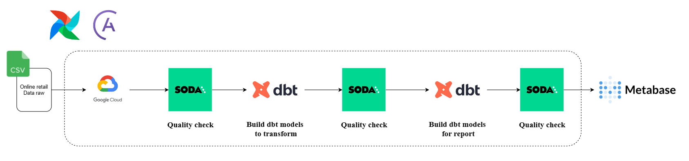
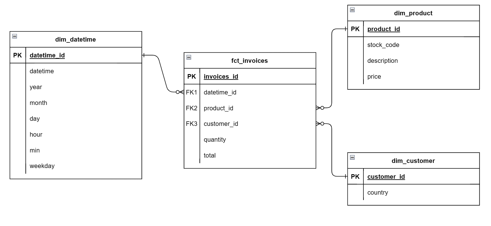
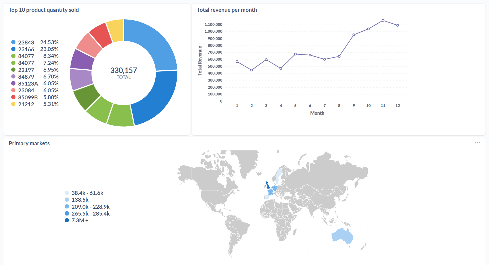

# Transform retail data and visualization

### Objective

This project's primary objectives include transforming online retail data, storing it in Google Cloud, and visualizing it using Metabase. The project leverages Airflow for task execution, Soda for data validation, and DBT for data transformation.

### Architecture

### Data modeling

### Process

1. Upload raw data to Google Cloud.
2. Using Soda to check the newly uploaded data.
3. Create table country in retail on Google Cloud.
4. Build dbt models to transform data.
5. Using Soda to check trasnform data.
6. Build dbt models to report data.
7. Using Soda to check report data.
8. Using Metabase to fetch data from Google Cloud and then utilizing the report data for visualization.

### Visualization

### Setup

##### Dataset

- [Retail](https://www.kaggle.com/datasets/tunguz/online-retail)

##### Airflow setup

- [Install Airflow](https://docs.astronomer.io/astro/cli/install-cli)

##### Soda setup

- [Using soda](https://github.com/ddooxhuy09/Transform_retail_data_and_visualization/include/soda)

##### dbt setup

- [Using dbt](https://github.com/ddooxhuy09/Transform_retail_data_and_visualization/include/dbt)

##### Docker setup

- [Using docker](Dockerfile)
